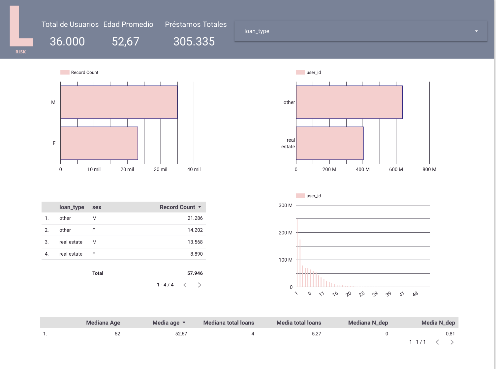

# Riesgo Relativo en lookerstudio

Ficha Técnica: Proyecto de Análisis de Datos

Título del Proyecto: Riesgo Relativo en Looker Studio

Objetivo:
Realizar una prueba de hipótesis, utilizando una técnica de analisis de datos de segmentación y riesgo relativo.

Equipo:
Trabajo Individual.

Herramientas y Tecnologías:
- Google BigQuery.
- Looker Studio.
- Google Slides.

Procesamiento y análisis:
- limpieza de datos
- exploración de datos
- consultas SQL
- Técnica de Análisis de datos
  
Resultados y Conclusiones:
Se probo la hipótesis mediante insights concluidos por gráficos y técnicas de análisis.

Dashboard

Limitaciones/Próximos Pasos:

Enlaces de interés:
[google slides](https://docs.google.com/presentation/d/1eBlx9hKla9FAeFiUN3BKeECJP97DlD57f0p1xYaDhSE/edit?usp=sharing)
[informe en looker studio](https://lookerstudio.google.com/reporting/58ab40fa-c933-4253-8695-886ee40f4b21)
